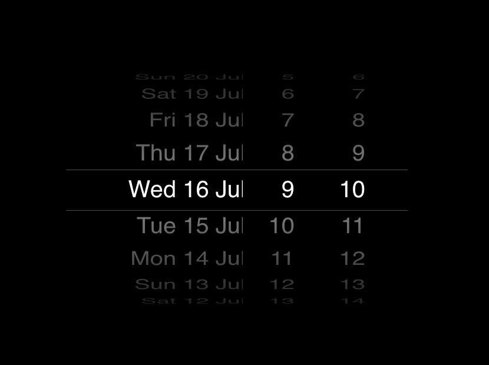

# iOS Timepicker (keen-slider)
An elegant iOS-style time picker built on top of **keen-slider** — fast, touch-friendly, and easy to integrate.




---

## Features

* Native-feeling wheel (iOS-like) time selection (hours / minutes / AM–PM).
* Smooth touch and drag interactions with inertia and snap behavior.
* Easy to style and localize.
* Lightweight and framework-agnostic (works in VanillaJS, React, Vue, Angular).

---

## Installation

Install keen-slider as a dependency:

```bash
npm install keen-slider
# or
yarn add keen-slider
```

Import the stylesheet (required):

```js
import "keen-slider/keen-slider.min.css";
```

---

## Quick start — Vanilla JS

**HTML**

```html
<div class="timepicker">
  <div class="keen-slider hour-wheel">
    <!-- Generate slides for hours: 0..23 or 1..12 -->
    <div class="keen-slider__slide">00</div>
    <div class="keen-slider__slide">01</div>
    <!-- ... -->
  </div>

  <div class="keen-slider minute-wheel">
    <!-- Minutes (e.g. 00, 05, 10, ...) -->
  </div>

  <div class="keen-slider ampm-wheel">
    <div class="keen-slider__slide">AM</div>
    <div class="keen-slider__slide">PM</div>
  </div>
</div>
```

**JavaScript (initialize wheels and sync selection)**

```js
import KeenSlider from "keen-slider";
import "keen-slider/keen-slider.min.css";

const hourSlider = new KeenSlider(".hour-wheel", {
  vertical: true,
  loop: false,
  drag: true,
  perView: 3, // center effect — show 3 items
  // configure snapping behaviors if needed
});

const minuteSlider = new KeenSlider(".minute-wheel", {
  vertical: true,
  loop: false,
  drag: true,
  perView: 3,
});

const ampmSlider = new KeenSlider(".ampm-wheel", {
  vertical: true,
  loop: false,
  drag: true,
  perView: 3,
});

// Example: read the selected slide when slider changes
hourSlider.on("slideChanged", (s) => {
  const idx = s.details().relativeSlide;
  // read value from DOM or keep an array of values
});

// Combine values from all wheels into a single time string for your form
```

> Tip: Render an odd number of visible slides (3 or 5) so the middle slide is visually selected. Use CSS to highlight the center/selected item.

---

## Styling & UX notes

* Use `perView` (or `slides` depending on version) to control how many items are visible and center the active item visually with padding or transforms.
* Add a semi-transparent overlay or a highlighted center bar to indicate the selected value.
* For accessibility, expose the selected value with `aria-live` and keep a hidden form input so keyboard and screen-reader users can read/submit the value.
* Optionally add keyboard handlers (arrow up/down) to move the wheel.

---

## Customization

* **Step interval (minutes):** generate minute slides for 1, 5, 10, 15, etc.
* **12-hour vs 24-hour:** build hours array accordingly.
* **Disabled ranges:** visually disable some slides and programmatically skip them when computing selection.
* **Styling:** override or extend `.keen-slider__slide` styles to match your design.

---

## Accessibility

* Keep a hidden input or `role="spinbutton"` that mirrors the selected time for forms and assistive tech.
* Provide keyboard support (Up/Down for one step; Home/End for min/max).
* Use `aria-live="polite"` to announce value changes for screen readers.

---


## License

MIT

---

## Notes

* This component intentionally relies on keen-slider to recreate the iOS wheel interaction. **Use keen-slider for Timepicker ios.**
